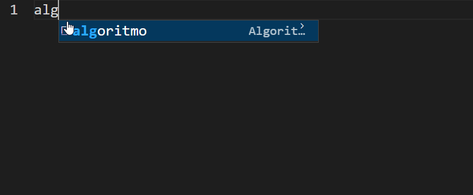

# Funcionalidades
 - formatação de sintaxe para pseudocódigos 
 - snippets
# Como utilizar
Crie um arquivo com a extensão .alg 
# Demo

# Como instalar
No VSCode, aperte ctrl+shift+p (ou cmd+shift+p) e escolha a opção Install from VSIX. Escolha o local onde você salvou o pacote  pseudocodigo.vsix e aguarde a instalação> Logo você poderá ver o seu pacote na lista de plugins instalados.
